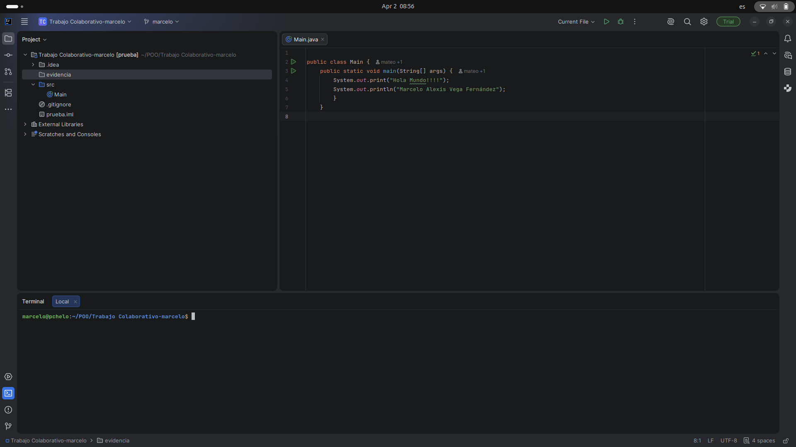
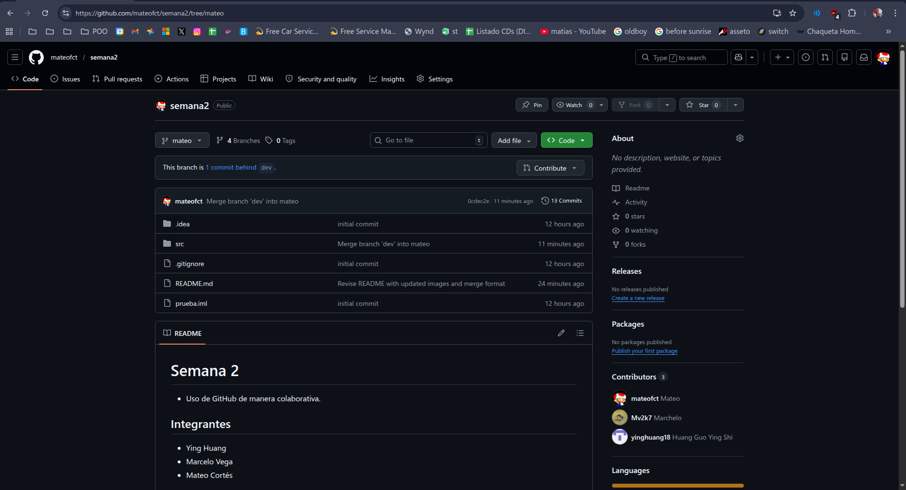
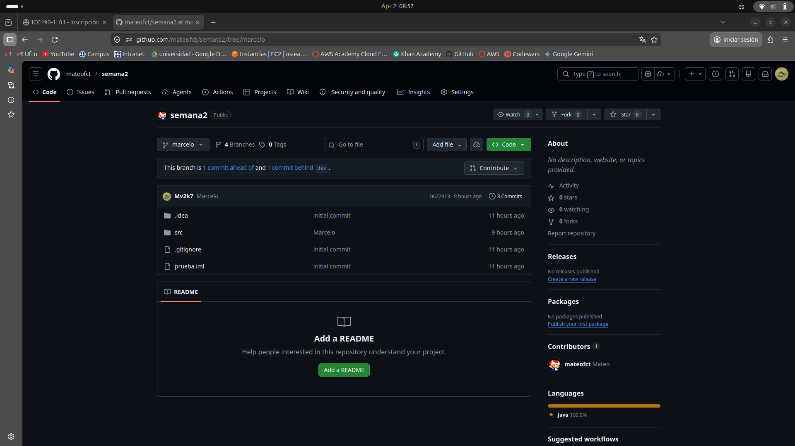
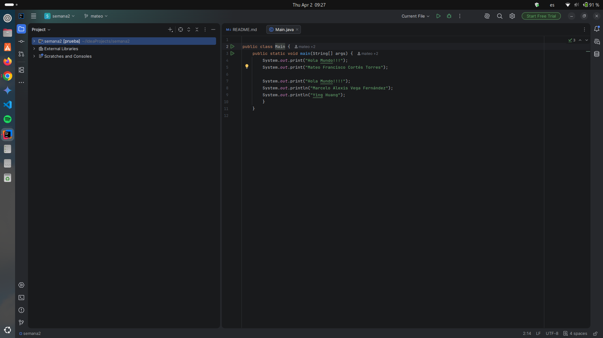

# Semana 2
* Uso de GitHub de manera colaborativa.

##  Integrantes
* Ying Huang
* Marcelo Vega
* Mateo Cortés

##  Actividades
1. **Inicio:** Crear repositorios y branches de forma local.
2. **Alojar:** Programa `HolaMundo.java` en rama específica, dejando sin tocar `master`.
3. **Modificar:** Actualización del código con nombre y sync remota.
4. **Integrar:** Hacer `merge`.

##  Evidencias
### Desarrollo Local (IntelliJ)

### Estado del Repositorio en GitHub

##  Conclusiones
*Muy buen trabajo
